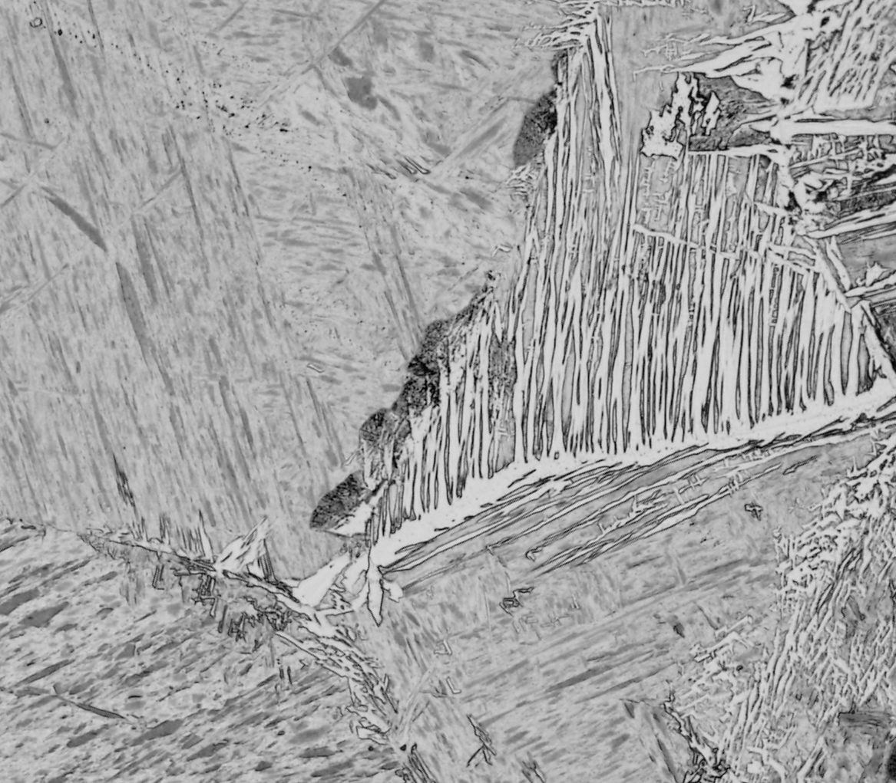
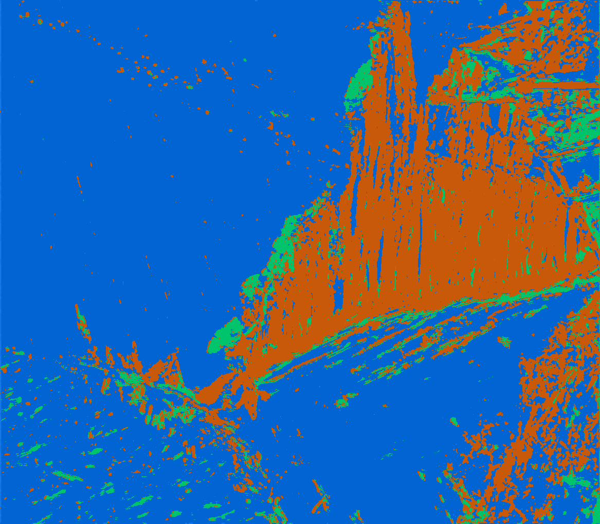

**Unsupervised segmentation for microstructure analysis in steel alloys**
---
## 1. Reference

This repository contains the official Pytorch implementation of the following paper:

> **"Unsupervised microstructure segmentation by mimicking metallurgists’ approach to pattern recognition."** *Scientific Reports* 10, Article number: 17835 (2020).  
> [](https://www.nature.com/articles/s41598-020-74935-8.pdf)

## 2. Project Overview

This repository implements an **unsupervised segmentation** for analyzing steel microstructures without labeled data. It leverages convolutional neural networks combined with superpixel techniques to mimic human's phase recognition strategies.

---

## 2. Example Input & Output

<p align="center">
  
  
</p>

---

## 3. Installation & Setup

### Prerequisites
- Python 3.x (ideally ≥ 3.8)

### Installation
```bash
git clone https://github.com/hohkim8812/unsupervised-microseg.git
cd unsupervised-microseg
```

---

## 4. Repository Structure

```
unsupervised-microseg/
├── input/
│   └── example_01.png           # Sample microstructure image
├── output/
│   └── example/
│       └── segmented_01.png     # Segmentation result
├── config.py                    # Hyperparameters and settings
├── main.py                      # Training/segmentation pipeline
├── model.py                     # Unsupervised segmentation model
├── predict.py                   # Single-image inference
└── utils.py                     # Utility functions (data loading, metrics, etc.)
```

---

## 5. Usage Instructions

### (1) Segmentation without a saved model
```bash
python main.py --input path/to/input_image
```

### (2) Segmentation with a saved model
```bash
python predict.py --input input/example_01.png --model_path path/to/saved_model.pth
```

---

## 6. Contact

- **GitHub**: [hohkim8812](https://github.com/hohkim8812)
- **Email**: hohkim8812@gmail.com 
